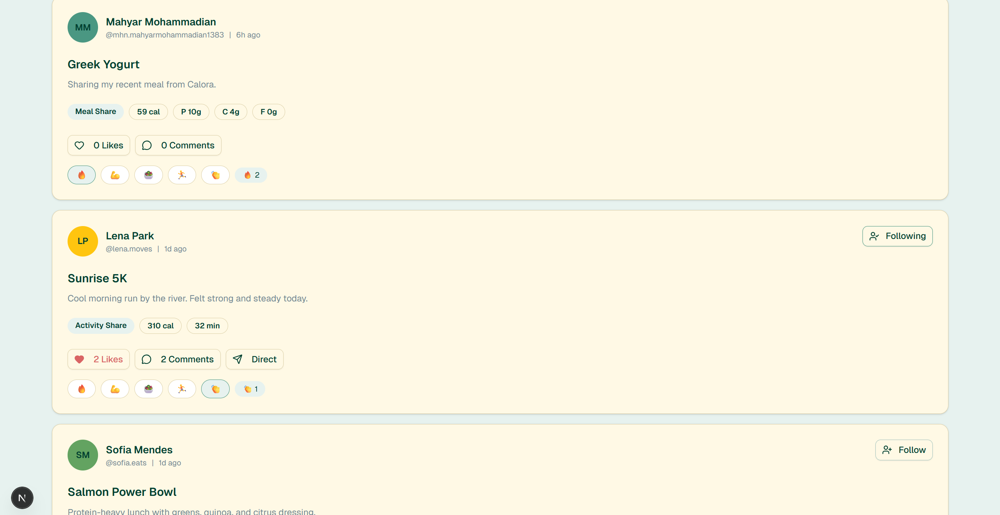
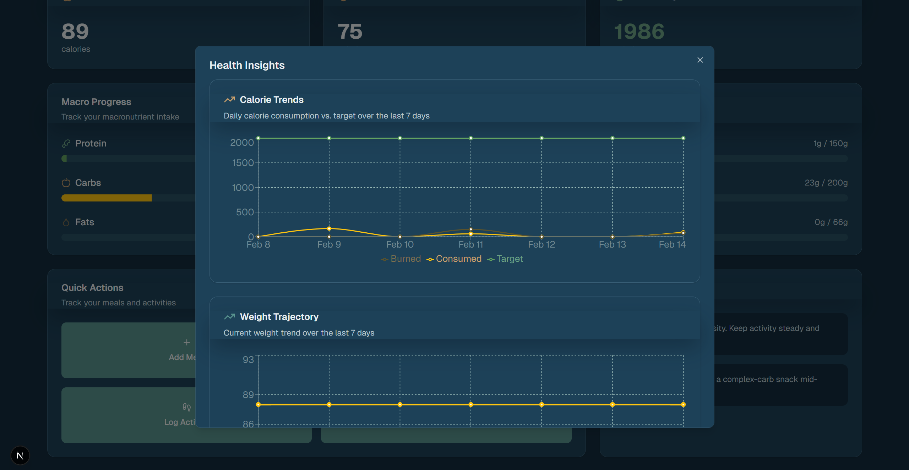

# Calora

<p align="center">
  
</p>

Calora is a full-stack nutrition and activity tracking app with dashboards, meal logging, activity history, premium features, and a lightweight social explore feed. The project is designed for local development with a Spring Boot backend and a Next.js frontend.

## Features
- Dashboard with calorie, macro, and activity summaries
- Meal and food logging (custom meals, recents, recipe catalog)
- Activity tracking and history
- AI-like insights and weekly meal plans (local, no external APIs)
- Premium feature gating with subscription flow and budget tracking
- Explore feed with posts, reactions, comments, follows, and direct messages
- Privacy and profile management

## Tech Stack
- Frontend: Next.js 16, React 19, Tailwind CSS 4
- Backend: Spring Boot 3, Java, JPA/Hibernate
- Database: H2 (file-based local DB)

## Getting Started

### Prerequisites
- Node.js 18+ (20+ recommended)
- Java 21+ (project currently built with Java 22 in dev)

### Install
1. Install root dependencies (for the dev runner):
   - `npm install`
2. Install frontend dependencies:
   - `npm install --prefix frontend`

### Run (Frontend + Backend)
From the repository root:
```
npm run dev
```
This runs:
- Backend on `http://127.0.0.1:8081`
- Frontend on `http://localhost:3000`

### Run Separately
Backend:
```
cd backend
./mvnw spring-boot:run
```
Windows:
```
cd backend
mvnw.cmd spring-boot:run
```

Frontend:
```
npm run dev --prefix frontend
```

## Environment Variables
Frontend can optionally override the API base:
```
NEXT_PUBLIC_API_URL=http://127.0.0.1:8081
```
If not set, the frontend uses the current hostname with port `8081`.

## Forgot Password Flow
The project supports a local password reset flow without external email providers. The reset token is shown in the UI so you can test the flow locally.

## H2 Database
The backend uses a file-based H2 database:
- JDBC URL: `jdbc:h2:file:./data/calora`
- H2 Console (if enabled): `http://localhost:8081/h2-console`

## Tests
Frontend:
```
npm run build --prefix frontend
```

Backend:
```
cd backend
./mvnw test
```
Windows:
```
cd backend
mvnw.cmd test
```

## Project Structure
- `frontend/` Next.js app
- `backend/` Spring Boot service
- `backend/data/` H2 database files (local)

## Notes
- Premium features are enforced locally based on the user record.
- AI-related features are implemented locally without third-party APIs.

## Screenshots
<p align="center">
  
  
</p>
<p align="center">
  
  
</p>
<p align="center">
  
</p>
